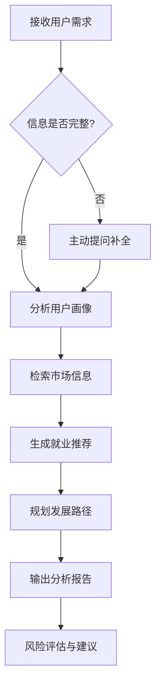

# Career Analysis Skill

## 简介

Career Analysis 是一个就业方向分析与发展路径规划的 SOLO Skill，帮助大学生、应届毕业生和职场人士进行职业规划。

## 功能特点

- **智能信息收集**：通过 3 轮主动提问，全面收集用户的教育背景、技能证书、实习经验、个人特质和就业意向
- **市场信息检索**：自动检索招聘网站、行业报告、薪资数据等多源信息
- **多维度匹配推荐**：基于教育背景、技能、经验、兴趣、价值观 5 个维度进行加权匹配
- **职业发展路径规划**：生成可视化的职业发展路径图，包含时间节点、关键要求、薪资预期
- **风险评估与建议**：识别行业风险、职位风险、个人风险、市场风险，并提供应对策略
- **完整分析报告**：输出结构化的就业分析报告，包含短期、中期、长期行动计划

## 适用人群

- 应届毕业生寻找第一份工作
- 职场人士考虑跳槽或晋升
- 转行者探索新的职业方向
- 对未来职业发展感到迷茫的同学

## 工作流程



## 使用方法

1. 在 SOLO 中加载 career-analysis Skill
2. 告诉它你的基本情况，例如："我是土木工程专业的本科生，应届毕业生"
3. 回答它的提问（3 轮左右）
4. 等待它检索市场信息并生成分析
5. 查看就业方向推荐和发展路径规划
6. 获取完整的就业分析报告

## 文档结构

```
career-analysis/
├── SKILL.md                          # 主技能文件
├── README.md                         # 本文件
└── references/                       # 参考文档
    ├── algorithms.md                 # 算法实现参考
    ├── analysis-methodology.md       # 分析方法论
    ├── career-paths.md               # 职业发展路径框架
    ├── common-career-paths.md        # 常见职业路径示例
    ├── company-analysis.md           # 企业分析框架
    ├── employment-sources.md         # 就业信息源
    ├── industry-analysis.md          # 行业分析框架
    ├── salary-analysis.md            # 薪资分析框架
    └── visualization-guide.md        # 可视化指南
```

## 核心算法

### 匹配度计算公式

```
匹配度 = 教育背景×0.2 + 技能匹配×0.3 + 经验匹配×0.25 + 兴趣匹配×0.15 + 价值观匹配×0.1
```

### 匹配等级划分

| 分数区间 | 匹配等级 | 建议 |
|----------|----------|------|
| 90-100 | 高度匹配 | 强烈推荐，优先考虑 |
| 80-89 | 较好匹配 | 推荐，可作为主要选择 |
| 70-79 | 一般匹配 | 可考虑，需要提升相关能力 |
| 60-69 | 勉强匹配 | 谨慎考虑，差距较大 |
| 0-59 | 匹配度低 | 不推荐，建议其他方向 |

## 示例

### 输入

```
我是土木工程专业的本科生，应届毕业生，想在二三线城市找工作
```

### 输出

- 5 个本专业方向推荐（公务员/事业单位、造价咨询、BIM 工程师、甲方工程管理、施工企业）
- 2 个转行方向推荐（BIM/建筑科技、商业数据分析）
- 4 条职业发展路径图
- 一份 3000+ 字的完整就业分析报告

## 参考文档说明

| 文档 | 说明 |
|------|------|
| [algorithms.md](references/algorithms.md) | 匹配度计算、推荐排序、路径规划等算法实现 |
| [analysis-methodology.md](references/analysis-methodology.md) | 信息收集和分析的方法论框架 |
| [career-paths.md](references/career-paths.md) | 职业发展路径的设计原则和模板 |
| [common-career-paths.md](references/common-career-paths.md) | 各行业典型职业发展路径示例 |
| [company-analysis.md](references/company-analysis.md) | 企业类型分析和选择建议 |
| [employment-sources.md](references/employment-sources.md) | 招聘网站、行业报告等信息源 |
| [industry-analysis.md](references/industry-analysis.md) | 行业趋势和前景分析框架 |
| [salary-analysis.md](references/salary-analysis.md) | 薪资水平和谈判策略分析 |
| [visualization-guide.md](references/visualization-guide.md) | 图表生成和可视化规范 |

## 最佳实践

1. **信息收集**：从核心信息开始，逐步深入，使用开放式和选择式问题结合
2. **信息检索**：使用优化的查询关键词，交叉验证多个数据源
3. **分析推荐**：综合考虑多个维度，平衡匹配度和发展潜力
4. **路径规划**：设计多条可行路径，标注关键节点和要求
5. **报告输出**：结构清晰，建议具体可操作，风险提示全面客观

## 注意事项

- 所有数据来源于公开渠道，仅供参考
- 职业规划需要结合个人实际情况，建议多方咨询
- 市场数据会随时间变化，建议定期更新
