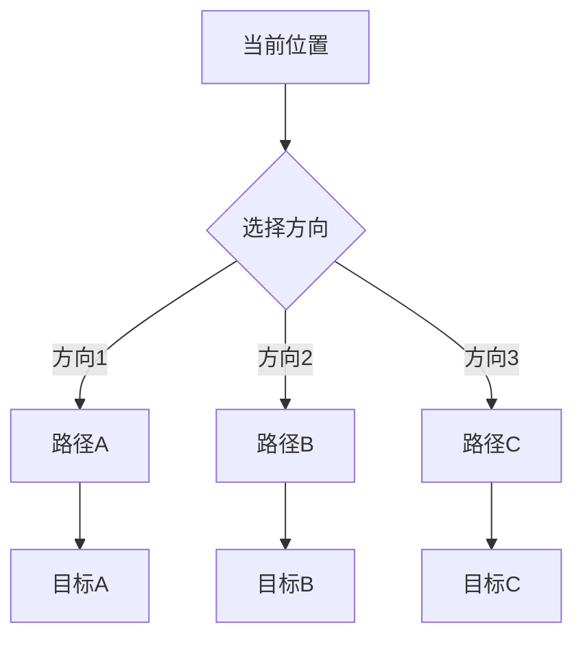
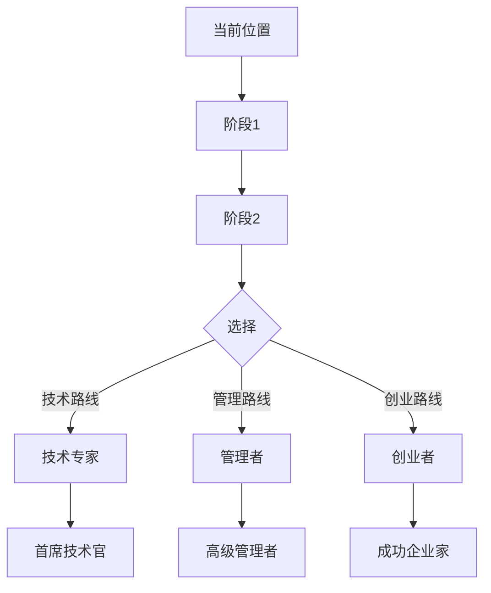
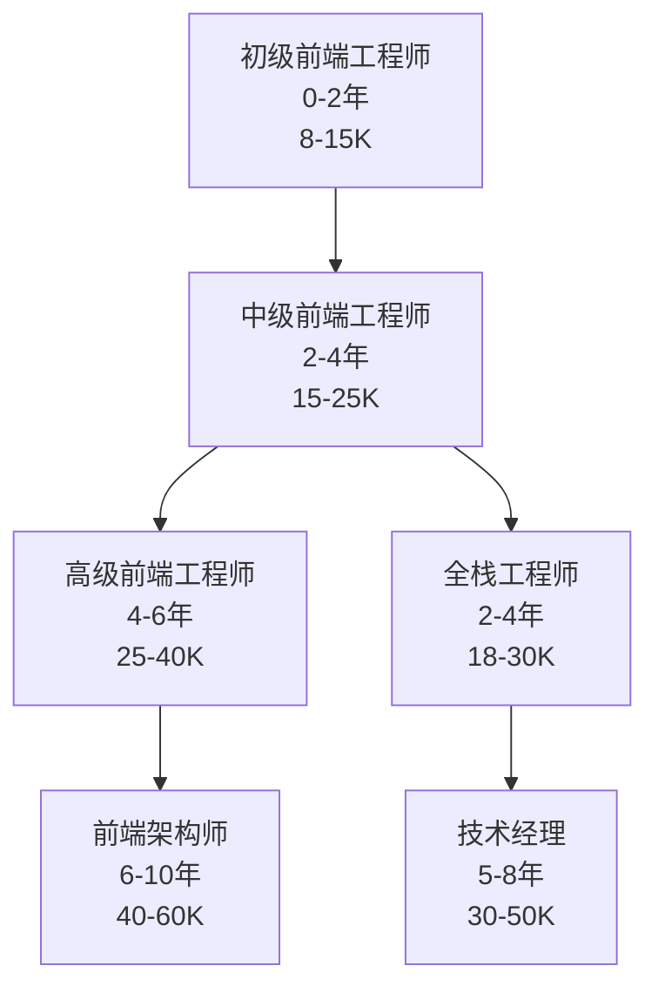

# 职业发展路径框架

## 职业发展阶段

| 阶段 | 时间 | 特征 | 关键任务 |
|------|------|------|----------|
| **探索期** | 0-2年 | 学习基础技能，建立职业认知 | 掌握核心技能，建立人脉基础 |
| **成长期** | 2-5年 | 专业能力提升，承担更多责任 | 深化专业知识，参与项目管理 |
| **成熟期** | 5-10年 | 成为领域专家或管理者 | 带领团队，战略思维培养 |
| **转型期** | 10年+ | 职业转型或创业 | 战略决策，资源整合 |

## 发展路径类型

### 纵向发展（垂直晋升）
在同一职能领域内晋升，适合追求深度专业发展的人。

**示例路径**：
```
初级专员 → 中级专员 → 高级专员 → 资深专家 → 首席专家
```

### 横向发展（跨职能转型）
转换到相关但不同的职能领域，适合希望拓宽技能边界的人。

**示例路径**：
```
技术工程师 → 产品经理 → 产品总监
市场专员 → 运营经理 → 运营总监
```

### 斜向发展（跨行业/跨层级）
同时改变行业和职能层级，适合追求快速成长的人。

**示例路径**：
```
传统行业专员 → 互联网公司主管 → 创业公司合伙人
```

## 路径图生成方法

### 步骤1：现状分析
分析当前状态：
- 核心技能
- 工作经验
- 优势劣势
- 资源积累

### 步骤2：目标设定
设定职业目标：
- 短期目标（1-2年）
- 中期目标（3-5年）
- 长期目标（5-10年）

### 步骤3：路径设计
设计多条可行路径：
- 主路径：最优选择
- 备选路径：次优选择
- 应急路径：保底选择

### 步骤4：差距分析
识别当前与目标的差距：
- 技能差距
- 经验差距
- 资源差距

### 步骤5：行动计划
制定具体的提升计划：
- 技能提升计划
- 经验积累计划
- 人脉建设计划

## 路径图模板

### 线性路径


### 分支路径


### 复合路径


## 路径评估维度

| 维度 | 评估要点 | 权重 |
|------|----------|------|
| **兴趣匹配** | 是否对工作内容感兴趣 | 25% |
| **能力匹配** | 是否具备相应能力 | 25% |
| **价值观匹配** | 是否符合个人价值观 | 20% |
| **发展机会** | 是否有良好的发展空间 | 20% |
| **薪资待遇** | 是否满足经济需求 | 10% |

## 风险评估

| 风险等级 | 特征 | 适用场景 |
|----------|------|----------|
| **低风险** | 稳定行业、成熟岗位、明确路径 | 追求稳定发展 |
| **中风险** | 发展中行业、新兴岗位、探索性路径 | 愿意适度冒险 |
| **高风险** | 衰退行业、不稳定岗位、激进转型 | 追求高回报 |

## 路径图输出规范

### 节点信息
每个节点应包含：
- 职位/角色名称
- 预计时长
- 关键要求
- 薪资范围

### 边信息
每条边应包含：
- 转型条件
- 所需时间
- 难度评估
- 成功概率

### 示例
