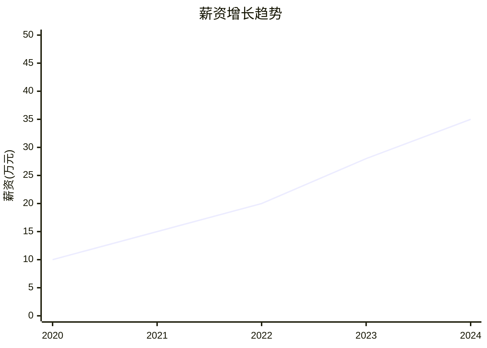
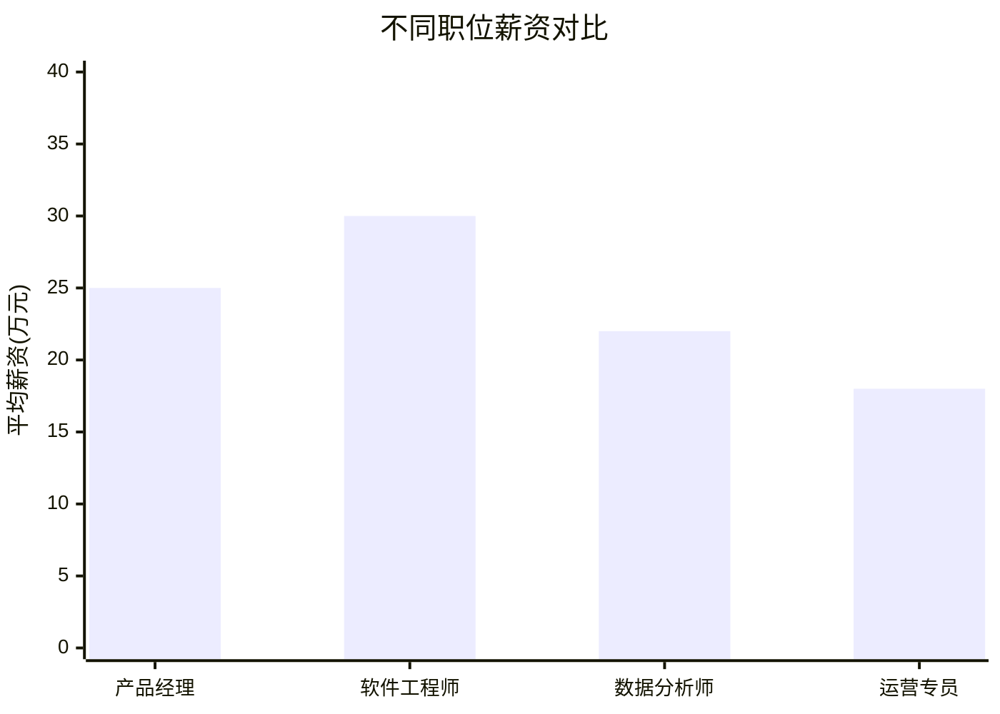
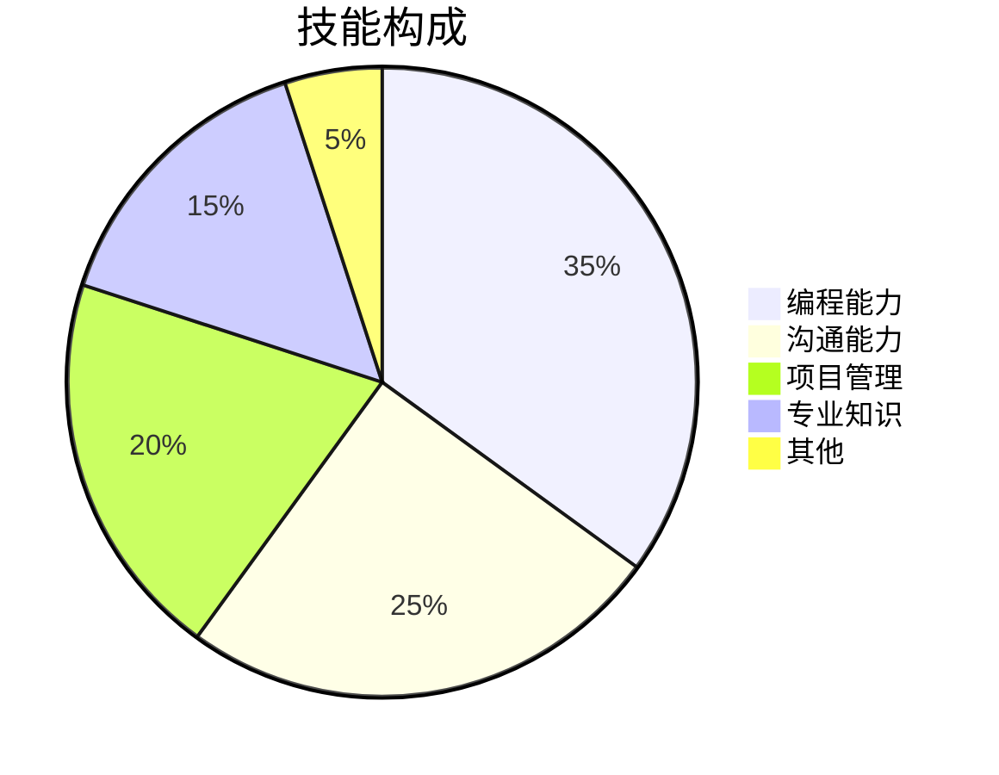
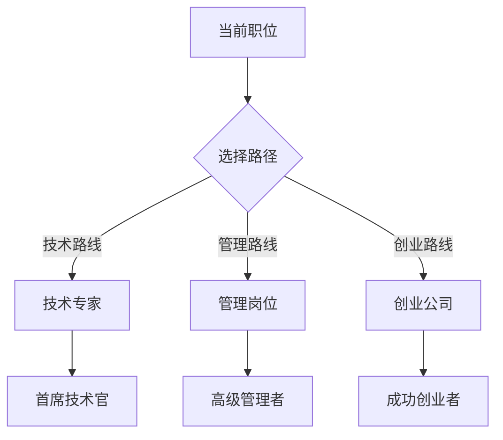
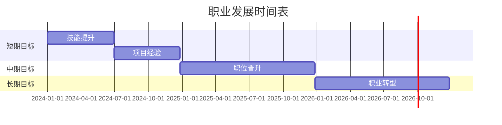

# 数据可视化指南

## 图表类型选择

### 1. 趋势分析图表

#### 折线图 (Line Chart)
**适用场景**: 展示数据随时间的变化趋势
**示例**: 薪资增长趋势、行业发展曲线
**Mermaid语法**:


#### 面积图 (Area Chart)
**适用场景**: 展示数据随时间的变化及累积效应
**示例**: 技能积累曲线、经验成长曲线
**特点**: 折线图下方填充颜色，强调累积效果

### 2. 对比分析图表

#### 柱状图 (Bar Chart)
**适用场景**: 比较不同类别的数据大小
**示例**: 不同职位薪资对比、不同行业需求对比
**Mermaid语法**:


#### 雷达图 (Radar Chart)
**适用场景**: 多维度能力对比分析
**示例**: 个人能力评估、岗位要求匹配度
**Mermaid语法**:
```mermaid
radar
    title 个人能力评估
    axis 沟通能力, 技术能力, 领导力, 学习能力, 创新能力
    curve 候选人A [85, 90, 70, 80, 75]
    curve 候选人B [70, 85, 85, 75, 80]
```

### 3. 占比分析图表

#### 饼图 (Pie Chart)
**适用场景**: 展示各部分占总体的比例
**示例**: 时间分配、技能构成、行业分布
**Mermaid语法**:


#### 环形图 (Donut Chart)
**适用场景**: 饼图的变体，中间可显示关键信息
**示例**: 能力分布、资源分配
**特点**: 比饼图更现代，视觉效果更好

### 4. 关系分析图表

#### 散点图 (Scatter Plot)
**适用场景**: 展示两个变量之间的关系
**示例**: 薪资与经验关系、学历与薪资关系
**Mermaid语法**:
```mermaid
xychart-beta
    title "经验与薪资关系"
    x-axis "工作年限" 0 --> 15
    y-axis "薪资(万元)" 0 --> 60
    scatter [1, 8], [2, 12], [3, 18], [5, 25], [8, 35], [10, 45]
```

#### 气泡图 (Bubble Chart)
**适用场景**: 展示三个变量的关系
**示例**: 薪资、经验、满意度三维关系
**特点**: 散点图的扩展，气泡大小表示第三个变量

### 5. 路径分析图表

#### 流程图 (Flowchart)
**适用场景**: 展示流程、路径、决策树
**示例**: 职业发展路径、决策流程
**Mermaid语法**:


#### 甘特图 (Gantt Chart)
**适用场景**: 展示时间计划和进度
**示例**: 职业发展时间表、学习计划
**Mermaid语法**:


## 图表设计规范

### 1. 颜色规范

#### 主色调
- **主色**: #1890FF (蓝色) - 主要元素、强调内容
- **辅助色**: #52C41A (绿色) - 积极信息、增长趋势
- **警告色**: #FAAD14 (橙色) - 警告信息、注意事项
- **危险色**: #FF4D4F (红色) - 危险信息、下降趋势
- **中性色**: #8C8C8C (灰色) - 次要信息、辅助元素

#### 颜色使用原则
1. **一致性**: 同类数据使用相同颜色
2. **对比度**: 确保足够的对比度
3. **可访问性**: 考虑色盲用户的需求
4. **简洁性**: 避免过多颜色，一般不超过5种

### 2. 字体规范

#### 字体选择
- **标题**: 粗体、较大字号，突出显示
- **正文**: 常规字体、适中字号，易于阅读
- **标签**: 较小字号，不干扰主要内容
- **数据标签**: 清晰易读，与图表协调

#### 字号建议
- **主标题**: 18-24px
- **副标题**: 14-16px
- **正文**: 12-14px
- **标签**: 10-12px
- **数据标签**: 10-12px

### 3. 布局规范

#### 图表布局
- **标题区**: 图表顶部，清晰描述内容
- **图表区**: 主要内容，占据主要空间
- **图例区**: 解释数据含义，位置灵活
- **数据区**: 坐标轴、标签、数据点

#### 间距建议
- **图表边距**: 适当留白，避免拥挤
- **元素间距**: 相关元素靠近，无关元素远离
- **对齐方式**: 保持对齐，增强可读性

### 4. 交互规范

#### 交互元素
- **悬停提示**: 显示详细信息
- **点击操作**: 展开或筛选数据
- **缩放功能**: 查看细节或整体
- **筛选功能**: 过滤特定数据

#### 交互设计原则
1. **即时反馈**: 操作后立即有响应
2. **明确指示**: 清晰的操作提示
3. **一致性**: 相同操作相同反馈
4. **可逆性**: 支持撤销操作

## 图表生成工具

### 1. Mermaid图表

#### 优势
- 语法简单，易于学习
- 支持多种图表类型
- 可直接嵌入Markdown
- 渲染效果良好

#### 常用图表类型
- **流程图**: graph TD/LR
- **时序图**: sequenceDiagram
- **类图**: classDiagram
- **状态图**: stateDiagram
- **甘特图**: gantt
- **饼图**: pie
- **象限图**: quadrantChart
- **需求图**: requirementDiagram

### 2. ASCII图表

#### 优势
- 纯文本，兼容性最好
- 无需特殊工具
- 可直接在代码中使用

#### 示例
```
薪资增长趋势
    ↑
40K |                           *
    |                       *
30K |                   *
    |               *
20K |           *
    |       *
10K |   *
    |___________________________→
    2020 2021 2022 2023 2024
```

### 3. 代码生成图表

#### Python库
- **Matplotlib**: 基础绑图库
- **Seaborn**: 统计可视化
- **Plotly**: 交互式图表
- **Bokeh**: 交互式可视化

#### JavaScript库
- **D3.js**: 数据驱动文档
- **Chart.js**: 简单易用
- **ECharts**: 功能丰富
- **Highcharts**: 商业级图表

## 图表应用场景

### 1. 职业发展路径图

#### 场景描述
展示从当前位置到目标职位的多种发展路径

#### 推荐图表
- **流程图**: 展示路径分支和选择
- **甘特图**: 展示时间规划
- **思维导图**: 展示可能性和选择

#### 设计要点
- 清晰标注起点和终点
- 多条路径用不同颜色区分
- 关键节点突出显示
- 添加时间标签和说明

### 2. 能力评估雷达图

#### 场景描述
评估个人在多个维度的能力水平

#### 推荐图表
- **雷达图**: 多维度对比
- **柱状图**: 单维度详细分析
- **散点图**: 能力与岗位匹配

#### 设计要点
- 选择关键能力维度
- 设定合理的评分标准
- 与岗位要求对比
- 提供改进建议

### 3. 薪资趋势分析图

#### 场景描述
分析不同职位或行业的薪资变化趋势

#### 推荐图表
- **折线图**: 趋势变化
- **柱状图**: 对比分析
- **面积图**: 累积效应

#### 设计要点
- 选择合适的时间范围
- 标注关键节点和事件
- 提供数据来源说明
- 添加趋势预测

### 4. 行业需求分布图

#### 场景描述
展示不同行业或职位的人才需求分布

#### 推荐图表
- **饼图**: 占比分布
- **柱状图**: 数量对比
- **气泡图**: 多维度分析

#### 设计要点
- 突出主要需求领域
- 提供详细数据标签
- 添加趋势说明
- 考虑地域差异

## 图表输出格式

### 1. 静态图片

#### 格式选择
- **PNG**: 通用格式，支持透明背景
- **JPEG**: 压缩格式，文件较小
- **SVG**: 矢量格式，缩放不失真
- **PDF**: 打印格式，保持高质量

#### 使用场景
- 报告文档
- 演示文稿
- 网页展示
- 打印输出

### 2. 交互式图表

#### 实现方式
- **HTML/JavaScript**: 网页交互
- **React/Vue组件**: 应用集成
- **Jupyter Notebook**: 数据分析
- **桌面应用**: 独立软件

#### 交互功能
- **悬停提示**: 显示详细信息
- **点击筛选**: 过滤数据
- **缩放平移**: 查看细节
- **数据导出**: 保存数据

### 3. 代码嵌入

#### Markdown嵌入
```markdown

```

#### HTML嵌入
```html
<div class="mermaid">
    graph TD
        A --> B
</div>
```

#### 代码库嵌入
```python
import matplotlib.pyplot as plt
# 绑图代码
plt.show()
```

## 图表最佳实践

### 1. 数据准确性
- 确保数据来源可靠
- 验证数据一致性
- 提供数据说明
- 标注数据时间

### 2. 视觉清晰性
- 选择合适的图表类型
- 使用清晰的颜色对比
- 保持简洁的布局
- 添加必要的标签和说明

### 3. 信息有效性
- 突出关键信息
- 避免信息过载
- 提供上下文说明
- 引导用户关注重点

### 4. 用户友好性
- 考虑用户背景
- 提供操作说明
- 支持多种设备
- 确保可访问性

## 图表生成流程

### 1. 需求分析
- 明确图表目的
- 确定目标受众
- 分析数据特点
- 选择图表类型

### 2. 数据准备
- 收集相关数据
- 清洗和整理数据
- 计算衍生指标
- 验证数据质量

### 3. 图表设计
- 设计图表结构
- 选择视觉元素
- 确定交互方式
- 制作原型草图

### 4. 图表实现
- 编写生成代码
- 调整视觉效果
- 测试交互功能
- 优化性能表现

### 5. 图表优化
- 收集用户反馈
- 分析使用数据
- 优化视觉效果
- 改进用户体验

### 6. 图表维护
- 定期更新数据
- 修复发现的问题
- 适应新的需求
- 保持技术更新